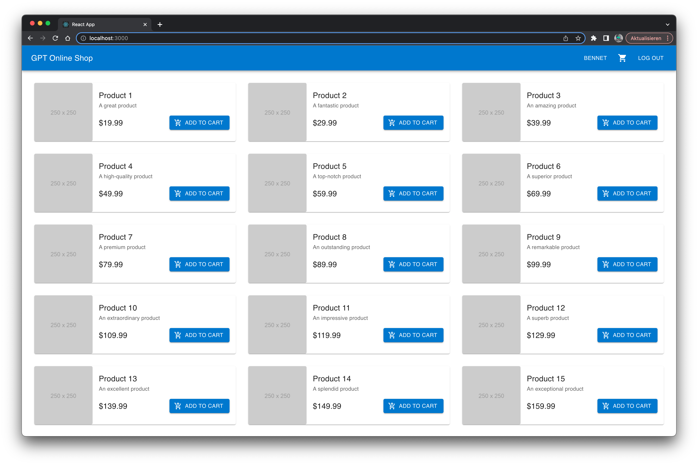
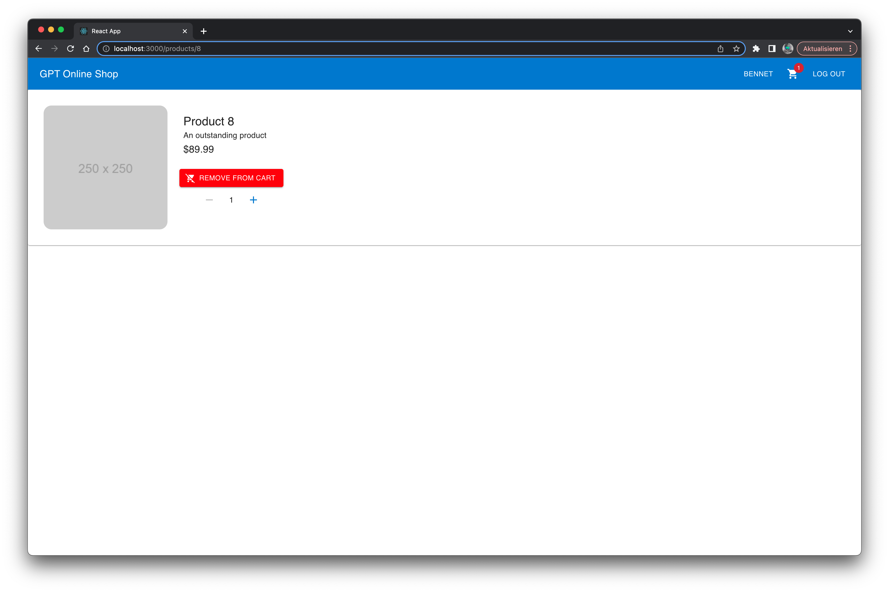
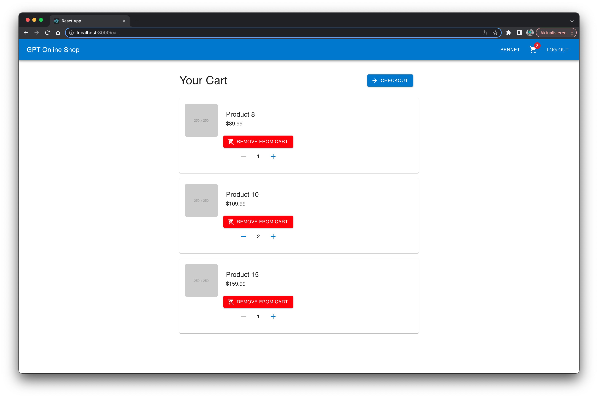
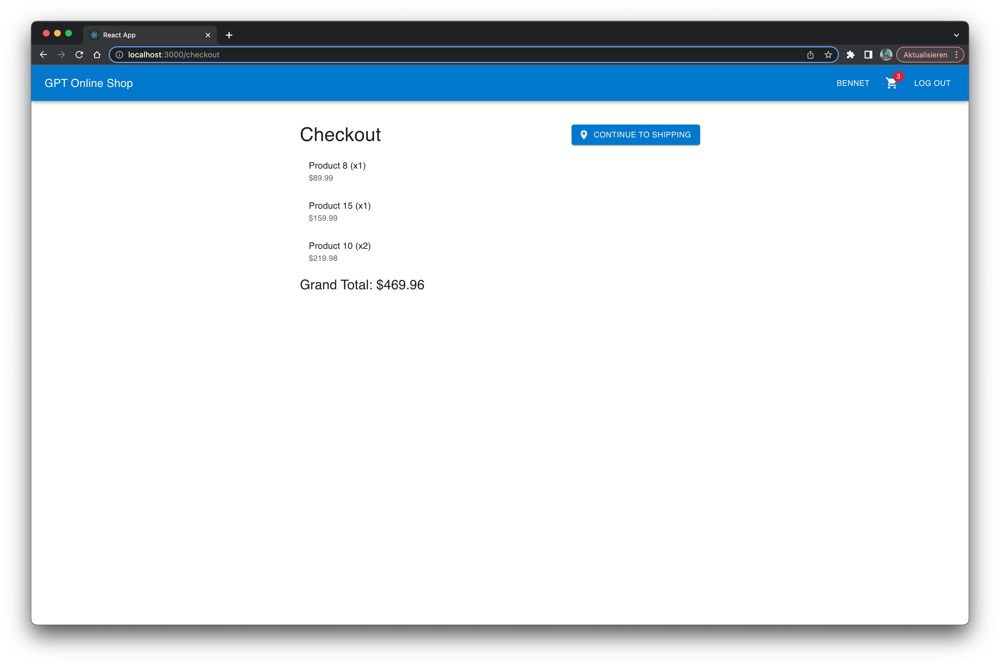
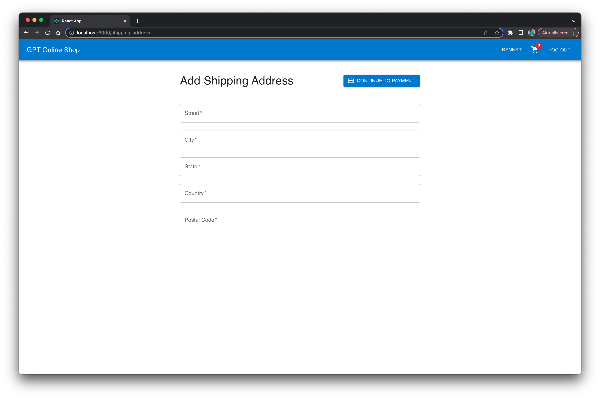

# gpt-online-shop

Experimental project to evaluate the efficacy of using a LLM like GPT-4 to generate a complete, non-trivial software project consisting of a backend and frontend.

Close to 100% of the code was generated by GPT-4.

Where possible, the prompts were written from the perspective of a non-developer that simply guides the model step-by-step, only driven by the requirements of the application and potential error messages, without hinting solutions (1 exception) 

## Evaluation
### Backend
#### Required manual interventions:
1. Fix dependencies to ktor-server
2. Add missing imports
3. Make migrate() non-suspending (don’t use newSuspendedTransaction)
4. Add implementation("io.ktor:ktor-server-content-negotiation:$ktorVersion“)
5. userId to user.id in mapping
6. Move Products table to DatabaseFactory
7. Move products mapping to controller
8. Rename EntityItemID to EntityID for CartItem
9. Add exposed java-time
10. Handle BigDecimal
11. Refactor transaction handling between services and repositories

#### Prompts
- Total prompts: 70
##### Follow-up prompts:
- Error correction: 26
- Missing code: 7
- Requirements not satisfied: 4
- Hint solution: 1

### Frontend
#### Required manual interventions:
1. Mixed up cart itemId and productId when updating cart item quantity 
2. Add React import
3. Add export to some interfaces
4. Manually add some routes

#### Prompts
- Total promps: 80
##### Follow-up prompts:
- Error correction: 17
    - of which dependency errors: 5
- Styling error/improvements: 10
- Missing code: 5
- Requirements not satisfied: 3
- Hint solution: 0

Many follow-up prompts were due to breaking changes in newer framework versions, GPT-4's cap at 2021 is a problem for software development.
Also only minimal prompt engineering was used, many follow-up prompts could probably be avoided by advanced prompt engineering techniques or further breaking down difficult tasks.

---

## Requirements

1. Users can log in and out
1. Users can register
1. Logged-in users can retrieve their personal information
1. Users can retrieve a list available products
1. A product has a name, description, image url, price and internally also a current stock quantity
1. Users can put a product into the cart
1. Users can increase or decrease a cart item’s quantity
1. Logged-in users can checkout the cart
1. Logged-in users can retrieve a summary and total after checkout
1. Logged-in users can add credit card information
1. Logged-in users can add a shipping address
1. Logged-in users can complete the purchase after checkout, using a specific payment method and shipping address
1. Logged-in users can retrieve their order history
1. There is a default admin user (password „admin“)
1. The admin user can retrieve a list of all orders
1. The admin user can mark an order as shipped

## Screenshots







## Generated Package Structure

### Backend

```
root
├── main
│   ├── kotlin
│   │   ├── com
│   │   │   ├── yourshop
│   │   │   │   ├── application
│   │   │   │   │   ├── auth
│   │   │   │   │   │   ├── AuthController.kt
│   │   │   │   │   │   ├── AuthService.kt
│   │   │   │   │   │   └── AuthRepository.kt
│   │   │   │   │   ├── cart
│   │   │   │   │   │   ├── CartController.kt
│   │   │   │   │   │   ├── CartService.kt
│   │   │   │   │   │   └── CartRepository.kt
│   │   │   │   │   ├── order
│   │   │   │   │   │   ├── OrderController.kt
│   │   │   │   │   │   ├── OrderService.kt
│   │   │   │   │   │   └── OrderRepository.kt
│   │   │   │   │   ├── product
│   │   │   │   │   │   ├── ProductController.kt
│   │   │   │   │   │   ├── ProductService.kt
│   │   │   │   │   │   └── ProductRepository.kt
│   │   │   │   │   ├── user
│   │   │   │   │   │   ├── UserController.kt
│   │   │   │   │   │   ├── UserService.kt
│   │   │   │   │   │   └── UserRepository.kt
│   │   │   │   │   └── Application.kt
│   │   │   │   ├── domain
│   │   │   │   │   ├── model
│   │   │   │   │   │   ├── CartItem.kt
│   │   │   │   │   │   ├── Order.kt
│   │   │   │   │   │   ├── Product.kt
│   │   │   │   │   │   └── User.kt
│   │   │   │   │   └── value
│   │   │   │   │       ├── Address.kt
│   │   │   │   │       └── CreditCard.kt
│   │   │   │   └── infrastructure
│   │   │   │       ├── database
│   │   │   │       │   ├── DatabaseFactory.kt
│   │   │   │       │   └── Migrations.kt
│   │   │   │       └── util
│   │   │   │           └── JwtUtils.kt
│   │   └── resources
│   │       └── application.conf
```

### Frontend

```
src/
  ├── components/
  │   ├── Admin/
  │   │   ├── AllOrders.tsx
  │   │   ├── OrderItem.tsx
  │   ├── Cart/
  │   │   ├── Cart.tsx
  │   │   ├── CartItem.tsx
  │   ├── Checkout/
  │   │   ├── Checkout.tsx
  │   │   ├── Payment.tsx
  │   │   ├── Shipping.tsx
  │   │   ├── Summary.tsx
  │   ├── Header/
  │   │   ├── Header.tsx
  │   │   ├── Login.tsx
  │   │   ├── Logout.tsx
  │   │   ├── Register.tsx
  │   ├── OrderHistory/
  │   │   ├── OrderHistory.tsx
  │   │   ├── OrderHistoryItem.tsx
  │   ├── Product/
  │   │   ├── Product.tsx
  │   │   ├── ProductList.tsx
  │   ├── Profile/
  │   │   ├── Profile.tsx
  ├── contexts/
  │   ├── CartContext.tsx
  │   ├── UserContext.tsx
  ├── services/
  │   ├── adminService.ts
  │   ├── authService.ts
  │   ├── cartService.ts
  │   ├── productService.ts
  │   ├── userService.ts
  ├── types/
  │   ├── admin.ts
  │   ├── auth.ts
  │   ├── cart.ts
  │   ├── product.ts
  │   ├── user.ts
  ├── utils/
  │   ├── api.ts
  │   ├── constants.ts
  ├── App.tsx
  ├── index.tsx
  ├── Routes.tsx
```

> **Note**
> The final file names and structure slightly deviates from this upfront design. As opposed to the backend, the folder structure was not repeated multiple times during prompting.

---

## Generated REST-API Design

### Register a new user
Endpoint: POST /api/users

Request Body: 
``` json 
{ "username": "string", "email": "string", "password": "string" } 
```
Response: HTTP status 201 Created, with the created user details (without password) in the response body

Response Body: 

``` json 
{ "id": "integer", "username": "string", "email": "string" } 
```

### Log in
Endpoint: POST /api/auth/login

Request Body: 
``` json 
{ "username": "string", "password": "string" } 
```
Response: HTTP status 200 OK, with an access token in the response body

Response Body: 
``` json 
{ "access_token": "string" } 
```
### Log out
Endpoint: POST /api/auth/logout

Headers: Authorization: Bearer 

Response: HTTP status 204 No Content

### Get user's personal information
Endpoint: GET /api/users/me

Headers: Authorization: Bearer 

Response: HTTP status 200 OK, with user details (without password) in the response body

Response Body: 
``` json 
{ "id": "integer", "username": "string", "email": "string" } 
```

### Add credit card information
Endpoint: POST /api/users/me/cards

Headers: Authorization: Bearer 

Request Body: 

``` json
{ "cardNumber": "string", "expiryMonth": "integer", "expiryYear": "integer", "cvv": "string" }
```

Response: HTTP status 201 Created, with the added credit card details (masked card number) in the response body

Response Body: 
``` json 
{ "id": "integer", "cardNumber": "string", "expiryMonth": "integer", "expiryYear": "integer" }
```

### Add a shipping address
Endpoint: POST /api/users/me/addresses

Headers: Authorization: Bearer 

Request Body: 
``` json 
{ "street": "string", "city": "string", "state": "string", "country": "string", "postalCode": "string" } 
```

Response: HTTP status 201 Created, with the added address details in the response body

Response Body: 
``` json 
{ "id": "integer", "street": "string", "city": "string", "state": "string", "country": "string", "postalCode": "string" } 
```

### Get a list of available products
Endpoint: GET /api/products

Query Parameters: page, limit

Response: HTTP status 200 OK, with a list of product details in the response body

Response Body: 
``` json
[ { "id": "integer", "name": "string", "description": "string", "imageUrl": "string", "price": "number" }, ...] 
```

### Get product details by ID
Endpoint: GET /api/products/{productId}

Path Parameter: productId

Response: HTTP status 200 OK, with the product details in the response body

Response Body: 
``` json 
{ "id": "integer", "name": "string", "description": "string", "imageUrl": "string", "price": "number" }
```

### Get the current user's cart
Endpoint: GET /api/cart

Headers: Authorization: Bearer 

Response: HTTP status 200 OK, with the cart items and their details in the response body

Response Body: 
``` json 
[ { "id": "integer", "product": { "id": "integer", "name": "string", "description": "string", "imageUrl": "string", "price": "number" }, "quantity": "integer" }, ...] 
```

### Add a product to the cart or update the quantity
Endpoint: POST /api/cart/items

Headers: Authorization: Bearer 

Request Body: 
``` json 
{ "productId": "integer", "quantity": "integer" } 
```

Response: HTTP status 200 OK, with the updated cart item details in the response body

Response Body:
``` json 
{ "id": "integer", "product": { "id": "integer", "name": "string", "description": "string", "imageUrl": "string", "price": "number" }, "quantity": "integer" } 
```

### Remove an item from the cart
Endpoint: DELETE /api/cart/items/{itemId}

Headers: Authorization: Bearer 

Path Parameter: itemId

Response: HTTP status 204 No Content

### Checkout the cart
Endpoint: POST /api/cart/checkout

Headers: Authorization: Bearer 

Response: HTTP status 200 OK, with the cart summary and total in the response body

Response Body: 
``` json 
{ "items": [ { "product": { "id": "integer", "name": "string", "description": "string", "imageUrl": "string", "price": "number" }, "quantity": "integer" }, ... ], "total": "number" } 
```

### Complete the purchase after checkout
Endpoint: POST /api/orders

Headers: Authorization: Bearer 

Request Body: 
``` json 
{ "paymentMethodId": "integer", "shippingAddressId": "integer" } 
```

Response: HTTP status 201 Created, with the order details in the response body

Response Body: 
``` json 
{ "id": "integer", "userId": "integer", "items": [ { "product": { "id": "integer", "name": "string", "description": "string", "imageUrl": "string", "price": "number" }, "quantity": "integer" }, ... ], "total": "number", "paymentMethod": { "id": "integer", "cardNumber": "string", "expiryMonth": "integer", "expiryYear": "integer" }, "shippingAddress": { "id": "integer", "street": "string", "city": "string", "state": "string", "country": "string", "postalCode": "string" }, "status": "string", "createdAt": "string", "updatedAt": "string" } 
```

### Get the order history for the logged-in user
Endpoint: GET /api/orders

Headers: Authorization: Bearer
 
Response: HTTP status 200 OK, with the list of order details in the response body

Response Body: 
``` json 
[ { "id": "integer", "userId": "integer", "items": [ { "product": { "id": "integer", "name": "string", "description": "string", "imageUrl": "string", "price": "number" }, "quantity": "integer" }, ... ], "total": "number", "paymentMethod": { "id": "integer", "cardNumber": "string", "expiryMonth": "integer", "expiryYear": "integer" }, "shippingAddress": { "id": "integer", "street": "string", "city": "string", "state": "string", "country": "string", "postalCode": "string" }, "status": "string", "createdAt": "string", "updatedAt": "string" }, ... ] 
```

### Get the list of all orders (admin only)
Endpoint: GET /api/admin/orders
Headers: Authorization: Bearer 
Response: HTTP status 200 OK, with the list of order details in the response body
Response Body: 
``` json
[{
  "id": "integer",
  "userId": "integer",
  "items": [
    {
      "product": {
        "id": "integer",
        "name": "string",
        "description": "string",
        "imageUrl": "string",
        "price": "number"
      },
      "quantity": "integer"
    },
    ...
  ],
  "total": "number",
  "paymentMethod": {
    "id": "integer",
    "cardNumber": "string",
    "expiryMonth": "integer",
    "expiryYear": "integer"
  },
  "shippingAddress": {
    "id": "integer",
    "street": "string",
    "city": "string",
    "state": "string",
    "country": "string",
    "postalCode": "string"
  },
  "status": "string",
  "createdAt": "string",
  "updatedAt": "string"
}, ...]
```

---

> **Note**
> The following two routes were generated later on request

### Mark Order as Shipped (Admin)
Endpoint: PATCH /api/admin/orders/{order_id}/mark-shipped

Header: Authorization: Bearer

### Billing
Endpoint: GET /api/users/me/billing 

Headers: Authorization: Bearer 

Response: HTTP status 200 OK, with the user's addresses and credit cards in the response body 

Response Body: 
``` json
{ "addresses": [ { "id": "integer", "street": "string", "city": "string", "state": "string", "country": "string", "postalCode": "string" }, ... ], "cards": [ { "id": "integer", "cardNumber": "string", "expiryMonth": "integer", "expiryYear": "integer" }, ... ] }
```


